<!-- Auto generate from tests -->
# EGraph Visualization Tests

This is a list of all the tests in the `tests` directory. Each test is a JSON file that is loaded into an EGraph and then rendered as an SVG.

| Test | Image | Inlined Leaves Image | Inlined Leaves Saturated Image |
| ---- | ----- | -------------------- | -------------------------- |
| [`diff_power_simple`](../tests/diff_power_simple.json) | 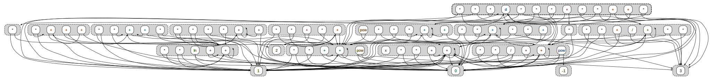 | 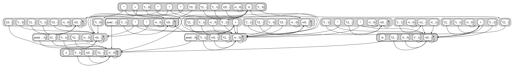 | 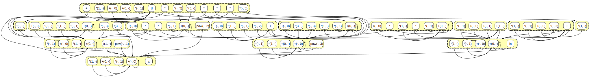 |
| [`eqsolve`](../tests/eqsolve.json) | 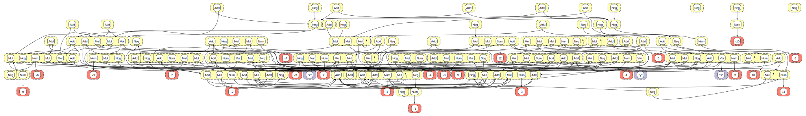 | 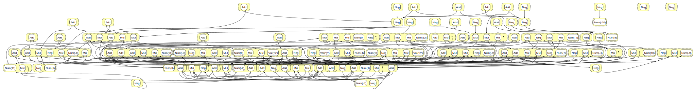 | 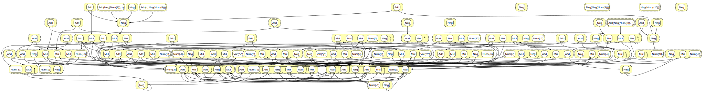 |
| [`fibonacci-demand`](../tests/fibonacci-demand.json) | 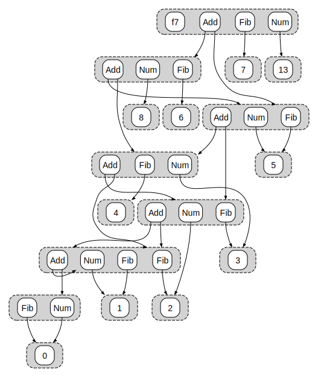 | 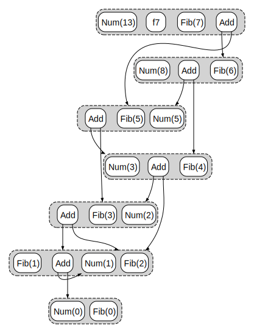 | 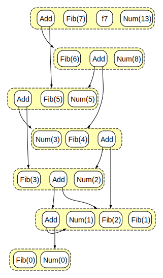 |
| [`fibonacci-split`](../tests/fibonacci-split.json) | 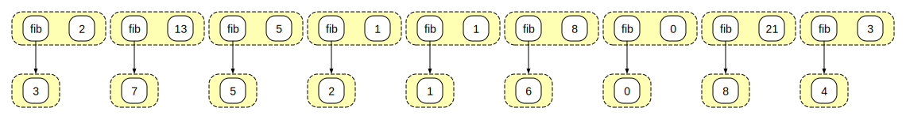 | 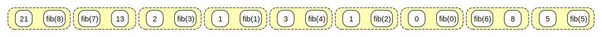 | 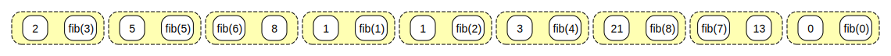 |
| [`fibonacci`](../tests/fibonacci.json) | 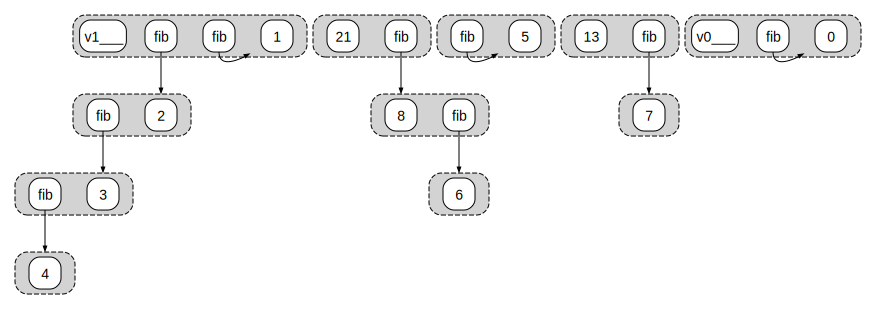 | 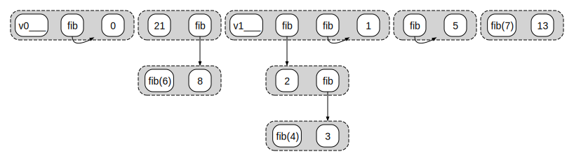 | 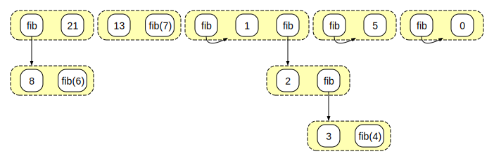 |
| [`lambda_if`](../tests/lambda_if.json) | 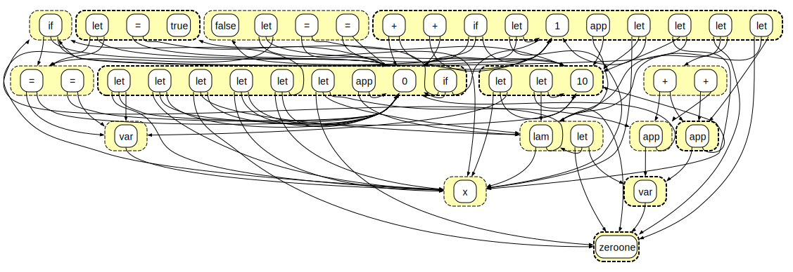 | 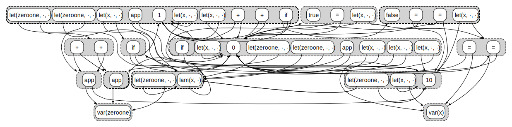 | 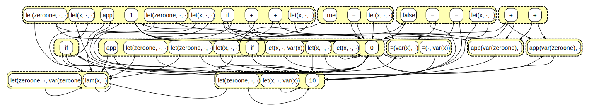 |
| [`list_list_hard_test_ellisk_2019-02-15T11.26.41--bench005_it7`](../tests/list_list_hard_test_ellisk_2019-02-15T11.26.41--bench005_it7.json) |  |  |  |
| [`math_powers`](../tests/math_powers.json) | 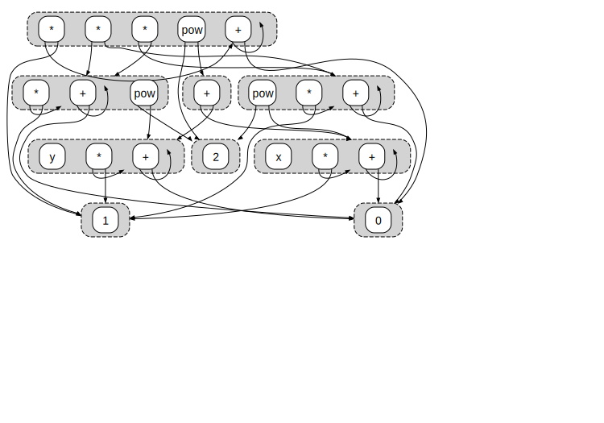 | 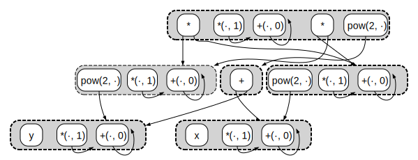 | 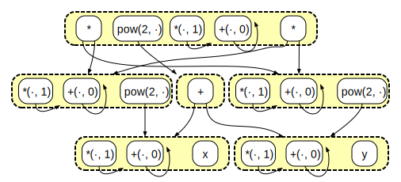 |
| [`path`](../tests/path.json) | 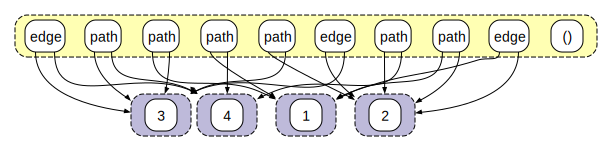 | 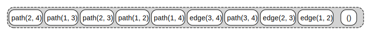 | 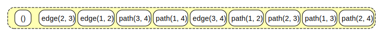 |
| [`physics_scientific_unsolved_4h_ellisk_2019-07-20T18.05.46--bench000_it0`](../tests/physics_scientific_unsolved_4h_ellisk_2019-07-20T18.05.46--bench000_it0.json) | 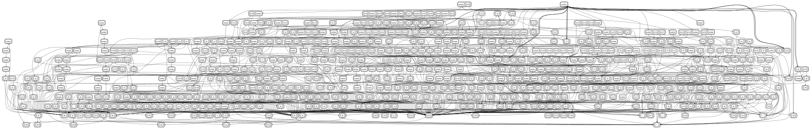 | 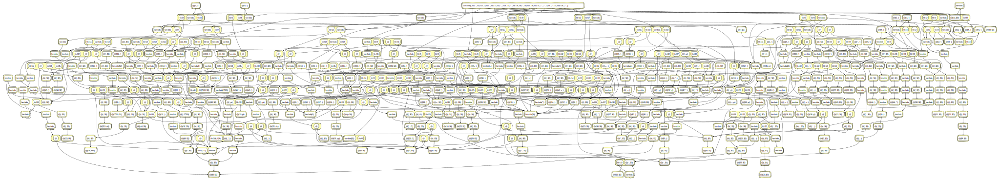 | 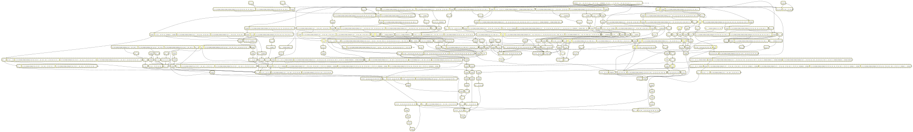 |
| [`tiny`](../tests/tiny.json) | 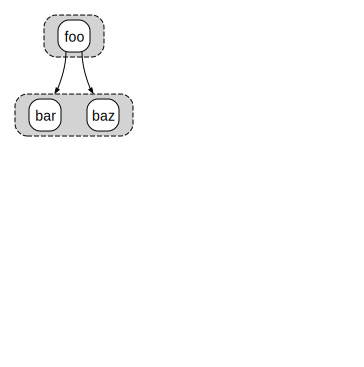 | 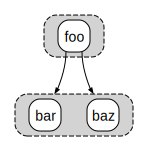 | 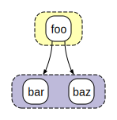 |